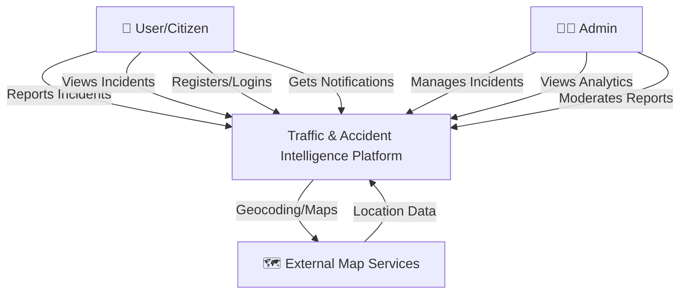
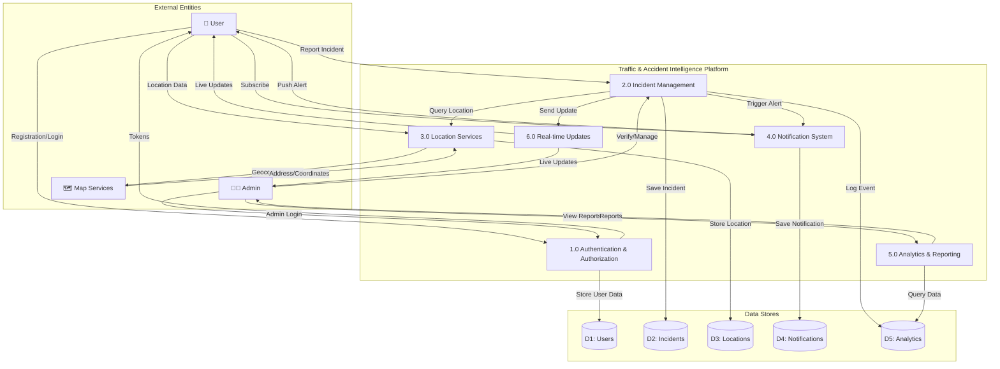
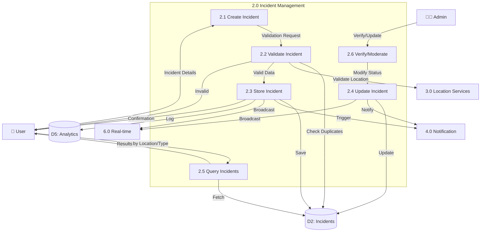
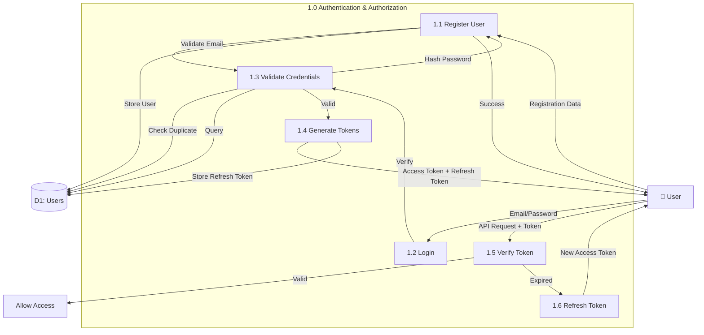
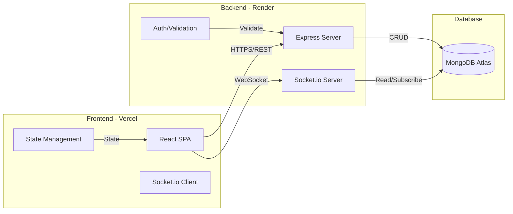
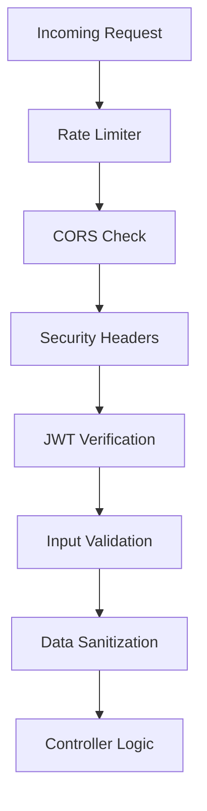

# Data Flow Diagram - Traffic & Accident Intelligence Platform

## Level 0 - Context Diagram

## Level 1 - System Processes

## Level 2 - Detailed Process: Incident Management

## Level 2 - Detailed Process: Authentication

## Data Flow Summary

### Key Data Flows:

1. **User Registration Flow**
   - User → Auth Service → Validation → User DB → Token Generation → User

2. **Incident Reporting Flow**
   - User → Incident Service → Validation → Location Service → Incident DB
   - → Notification Service → Real-time Broadcast → Other Users

3. **Real-time Updates Flow**
   - Incident Created/Updated → WebSocket Server → Connected Clients

4. **Location Processing Flow**
   - User Location → Location Service → Map API → Geocoded Data → Location DB

5. **Notification Flow**
   - Incident Event → Notification Service → User Preferences Check
   - → Push Notification → User Devices

6. **Analytics Flow**
   - All Events → Analytics Service → Aggregation → Analytics DB
   - → Dashboard → Admin

## Technology Stack Data Flow

## Security Data Flow

---

## How to View This Diagram

1. **In VS Code**: Install "Markdown Preview Mermaid Support" extension
2. **Online**: Copy the mermaid code to https://mermaid.live/
3. **Documentation**: Use in GitHub/GitLab (native support)

## Diagram Export

To export as image:
1. Open https://mermaid.live/
2. Paste the mermaid code blocks
3. Click "Export" → Choose format (PNG/SVG/PDF)
