# Data Flow Diagram - Traffic & Accident Intelligence Platform

## Level 0 - Context Diagram

```mermaid
graph TB
    User[👤 User/Citizen]
    Admin[👨‍💼 Admin]
    System[Traffic & Accident Intelligence Platform]
    ExtMap[🗺️ External Map Services]
    
    User -->|Reports Incidents| System
    User -->|Views Incidents| System
    User -->|Registers/Logins| System
    User -->|Gets Notifications| System
    
    Admin -->|Manages Incidents| System
    Admin -->|Views Analytics| System
    Admin -->|Moderates Reports| System
    
    System -->|Geocoding/Maps| ExtMap
    ExtMap -->|Location Data| System
```

## Level 1 - System Processes

## Level 2 - Detailed Process: Incident Management

```mermaid
graph TB
    subgraph "2.0 Incident Management"
        CreateIncident[2.1 Create Incident]
        ValidateIncident[2.2 Validate Incident]
        StoreIncident[2.3 Store Incident]
        UpdateIncident[2.4 Update Incident]
        QueryIncident[2.5 Query Incidents]
        VerifyIncident[2.6 Verify/Moderate]
    end
    
    User[👤 User] -->|Incident Details| CreateIncident
    CreateIncident -->|Validation Request| ValidateIncident
    ValidateIncident -->|Check Duplicates| IncidentDB[(D2: Incidents)]
    ValidateIncident -->|Validate Location| LocationService[3.0 Location Services]
    ValidateIncident -->|Valid Data| StoreIncident
    ValidateIncident -->|Invalid| User
    
    StoreIncident -->|Save| IncidentDB
    StoreIncident -->|Trigger| NotificationService[4.0 Notification]
    StoreIncident -->|Broadcast| WebSocket[6.0 Real-time]
    StoreIncident -->|Log| AnalyticsDB[(D5: Analytics)]
    StoreIncident -->|Confirmation| User
    
    User -->|Query by Location/Type| QueryIncident
    QueryIncident -->|Fetch| IncidentDB
    QueryIncident -->|Results| User
    
    Admin[👨‍💼 Admin] -->|Verify/Update| VerifyIncident
    VerifyIncident -->|Modify Status| UpdateIncident
    UpdateIncident -->|Update| IncidentDB
    UpdateIncident -->|Notify| NotificationService
    UpdateIncident -->|Broadcast| WebSocket
```

## Level 2 - Detailed Process: Authentication

```mermaid
graph TB
    subgraph "1.0 Authentication & Authorization"
        Register[1.1 Register User]
        Login[1.2 Login]
        ValidateCreds[1.3 Validate Credentials]
        GenerateToken[1.4 Generate Tokens]
        VerifyToken[1.5 Verify Token]
        RefreshToken[1.6 Refresh Token]
    end
    
    User[👤 User] -->|Registration Data| Register
    Register -->|Validate Email| ValidateCreds
    ValidateCreds -->|Check Duplicate| UserDB[(D1: Users)]
    ValidateCreds -->|Hash Password| Register
    Register -->|Store User| UserDB
    Register -->|Success| User
    
    User -->|Email/Password| Login
    Login -->|Verify| ValidateCreds
    ValidateCreds -->|Query| UserDB
    ValidateCreds -->|Valid| GenerateToken
    GenerateToken -->|Access Token + Refresh Token| User
    GenerateToken -->|Store Refresh Token| UserDB
    
    User -->|API Request + Token| VerifyToken
    VerifyToken -->|Valid| AllowAccess[Allow Access]
    VerifyToken -->|Expired| RefreshToken
    RefreshToken -->|New Access Token| User
```

## Data Flow Summary

### Key Data Flows:

1. **User Registration Flow**
   - User → Auth Service → Validation → User DB → Token Generation → User

2. **Incident Reporting Flow**
   - User → Incident Service → Validation → Location Service → Incident DB
   - → Notification Service → Real-time Broadcast → Other Users

3. **Real-time Updates Flow**
   - Incident Created/Updated → WebSocket Server → Connected Clients

4. **Location Processing Flow**
   - User Location → Location Service → Map API → Geocoded Data → Location DB

5. **Notification Flow**
   - Incident Event → Notification Service → User Preferences Check
   - → Push Notification → User Devices

6. **Analytics Flow**
   - All Events → Analytics Service → Aggregation → Analytics DB
   - → Dashboard → Admin

## Technology Stack Data Flow

## Security Data Flow

---

## How to View This Diagram

1. **In VS Code**: Install "Markdown Preview Mermaid Support" extension
2. **Online**: Copy the mermaid code to https://mermaid.live/
3. **Documentation**: Use in GitHub/GitLab (native support)

## Diagram Export

To export as image:
1. Open https://mermaid.live/
2. Paste the mermaid code blocks
3. Click "Export" → Choose format (PNG/SVG/PDF)
